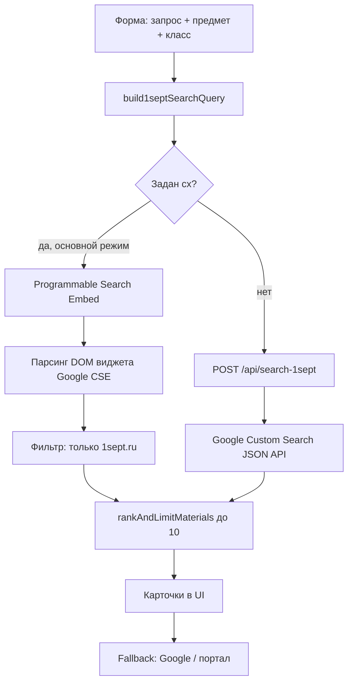

# Поиск материалов на портале «Первое сентября»

## Назначение

Вкладка **«Поиск материалов»** в правой колонке приложения помогает учителю найти готовые публикации на портале **«Открытый урок»** (`urok.1sept.ru`) — конспекты, методические разработки, сценарии и т.п. — по теме, предмету и классу.

Ссылки открываются **в новой вкладке**. Результаты не вставляются автоматически в план урока: это отдельный инструмент подбора материалов рядом с редактором.

---

## Где в интерфейсе

```
Левая колонка          Правая колонка
─────────────────      ─────────────────────────────
Форма урока            [✍ План урока] [📚 Поиск материалов]
(предмет, класс,       ─────────────────────────────
 тема, цель…)          Вкладка «Поиск материалов»:
                       форма + карточки результатов
```

Переключение вкладок — в `LessonPlanWorkspace.tsx` (`activeWorkspace: "lesson" | "materials"`). При первом открытии вкладки материалов монтируется `MaterialsSearchTab` (ленивая загрузка через `materialsWorkspaceMounted`).

**Важно:** предмет и класс на вкладке поиска — **свои независимые поля** в `MaterialsSearchTab`. Они **не синхронизируются** автоматически с формой урока слева (в корневом README это описано иначе — фактическое поведение такое).

---

## Архитектура: два режима поиска



| Режим | Когда используется | Нужны env-переменные | Биллинг Google Cloud |
|--------|-------------------|----------------------|----------------------|
| **Programmable Search Element (основной)** | Если задан `GOOGLE_CUSTOM_SEARCH_ENGINE_ID` (передаётся с сервера) или `NEXT_PUBLIC_GOOGLE_CUSTOM_SEARCH_ENGINE_ID` | Только `cx` | **Не требуется** |
| **Custom Search JSON API (запасной)** | Если `cx` не задан на клиенте | `GOOGLE_CUSTOM_SEARCH_API_KEY` + `GOOGLE_CUSTOM_SEARCH_ENGINE_ID` | Часто **требуется** (иначе 403) |

Логика выбора — в `MaterialsSearchTab.tsx`: при наличии `cx` вызывается скрытый виджет CSE (`embed.executeSearch(...)`), иначе — `POST /api/search-1sept`.

---

## Сборка поискового запроса

Модуль: `src/lib/build1septSearchQuery.ts`

Итоговая строка для Google собирается так:

1. Текст запроса пользователя
2. Предмет (если выбран)
3. `{N} класс` (если выбран класс)
4. Оператор **`site:urok.1sept.ru/publication`**

Пример: `дроби Математика 5 класс site:urok.1sept.ru/publication`

Ограничение длины — до 2000 символов. Константа `PUBLICATIONS_SITE_OPERATOR` экспортируется и проверяется на сервере в `/api/search-1sept`.

В виджете CSE дополнительно заданы атрибуты:

- `data-as_sitesearch="urok.1sept.ru"`
- `data-sort_by="date"`

---

## Основной режим: Programmable Search Embed

Файл: `src/components/materialsSearch/ProgrammableSearchEmbed.tsx`

### Инициализация

1. На страницу подгружается скрипт `https://cse.google.com/cse.js?cx=...`
2. В DOM создаётся скрытый контейнер с классом `gcse-search`
3. Вызывается `google.search.cse.element.go()` для рендера виджета

Виджет **не показывается пользователю** — он вынесен за экран в `MaterialsSearchTab.tsx`. Результаты **парсятся из DOM** и отображаются в собственных карточках.

### Запуск поиска

Через ref-метод `executeSearch(query)`:

- вызывается `element.execute(q)` у виджета Google CSE;
- запускается polling DOM (до ~11 с, шаг 200 мс);
- из разметки `.gsc-webResult`, `.gs-result` и т.п. извлекаются заголовок, URL, сниппет.

### Фильтрация результатов

- Принимаются только URL с хостом `1sept.ru` или `*.1sept.ru`
- Google-редиректы `/url?url=...` разворачиваются
- Дубликаты по каноническому URL отбрасываются
- Собирается до **30** кандидатов, затем ранжирование до **10**

### Клики по ссылкам

Глобальный обработчик `click` (capture) перехватывает клики по ссылкам внутри выдачи CSE и открывает материалы `1sept.ru` в **новой вкладке**, с `opener = null`.

### Ошибки загрузки

- Таймаут 15 с без разметки CSE → предупреждение «Не удалось показать поиск»
- Блокировщики рекламы могут резать `cse.google.com`
- Если виджет ещё не готов при нажатии «Найти» → «Поиск ещё загружается…»

---

## Запасной режим: серверный API

Эндпоинт: `POST /api/search-1sept`  
Файл: `src/app/api/search-1sept/route.ts`

### Тело запроса

```json
{
  "query": "дроби",
  "subject": "Математика",
  "grade": "5"
}
```

### Обработка

1. Проверка `GOOGLE_CUSTOM_SEARCH_API_KEY` и `GOOGLE_CUSTOM_SEARCH_ENGINE_ID`
2. Сборка запроса через `build1septSearchQuery`
3. GET к `https://www.googleapis.com/customsearch/v1` (`num=10`, `sort=date`)
4. Маппинг `items[]` → `{ title, url, snippet }`
5. `rankAndLimitMaterials(..., 10, context)`
6. Ответ: `{ results: [...] }`

### Типичные ошибки

| Ситуация | HTTP | Сообщение пользователю |
|----------|------|------------------------|
| Нет API key / cx | 500 | «Поиск не настроен на сервере» |
| Пустой запрос | 400 | «Поле поиска не может быть пустым» |
| 403 billing / нет доступа к JSON API | 502 | «Серверный поиск недоступен… откройте в Google» |
| Сеть | 502 | «Не удалось выполнить поиск» |

На клиенте `friendlySearchError()` переводит технические сообщения в понятный текст с предложением открыть Google или портал.

---

## Ранжирование результатов

Модуль: `src/lib/materialsSearchRanking.ts`

Функция: `rankAndLimitMaterials(results, limit=10, context)`

### Входной контекст

- `query` — текст запроса
- `subject` — предмет
- `grade` — класс

### Скоринг (если контекст задан)

| Фактор | Баллы (примерно) |
|--------|------------------|
| Точное вхождение запроса в заголовок | +45 |
| Запрос в тексте/snippet/URL | +20 |
| Токены запроса (≥3 символов) в заголовке | +22 каждый |
| Токены в остальном тексте | +8 |
| Подсказки предмета (русск, математ, истор…) | +16 / +8 |
| Упоминание класса («5 класс», «5-й класс»…) | +20 / +8 |
| Методические слова (конспект, план урока, сценарий…) | +5–8 |
| «Свежесть» по дате/году в тексте | +1–15 |
| Позиция в исходной выдаче Google | до +40 |

Без контекста сортировка только по «свежести» (дата/год в тексте), затем по исходному порядку.

Итог: **не более 10** карточек (`MAX_VISIBLE_RESULTS`).

---

## UI вкладки поиска

| Файл | Роль |
|------|------|
| `MaterialsSearchTab.tsx` | Оркестрация, состояние, карточки, fallback-ссылки |
| `MaterialsSearchForm.tsx` | Поля: запрос, предмет, класс, кнопка «Найти» |
| `ProgrammableSearchEmbed.tsx` | Скрытый виджет Google CSE |
| `EditorSearchTabs.tsx` | **Не используется** в текущем UI (остался как компонент) |

### Состояния экрана

1. **До поиска** — подсказка «Введите тему…»
2. **Идёт поиск** — спиннер «Идёт поиск по материалам…»
3. **Есть результаты** — до 10 карточек: номер, заголовок, сниппет, хост, кнопка «открыть»
4. **Пусто** — «Автоматически не удалось собрать ссылки» + кнопки fallback
5. **Ошибка** — жёлтый блок + ссылка «Открыть этот поиск в Google»

### Fallback-ссылки

Модуль: `src/lib/buildGoogleFallbackSearchUrl.ts`

Формирует URL вида:

```
https://www.google.com/search?q=site:urok.1sept.ru/publication {запрос} {предмет} {N класс}
```

Также есть прямая ссылка на портал: `https://urok.1sept.ru/`

---

## Конфигурация (переменные окружения)

| Переменная | Назначение |
|------------|------------|
| `GOOGLE_CUSTOM_SEARCH_ENGINE_ID` | **cx** — основной идентификатор CSE; читается на сервере при каждом запросе (`force-dynamic` в `page.tsx`) |
| `NEXT_PUBLIC_GOOGLE_CUSTOM_SEARCH_ENGINE_ID` | Опциональный дубликат cx для клиента (вшивается при сборке) |
| `GOOGLE_CUSTOM_SEARCH_API_KEY` | Только для запасного `POST /api/search-1sept` |

`cx` передаётся: `page.tsx` → `LessonPlanWorkspace` → `MaterialsSearchTab` → `ProgrammableSearchEmbed`.

### Настройка в Google (кратко)

1. [Programmable Search Engine](https://programmablesearchengine.google.com) → создать поисковую систему
2. В список сайтов добавить **`1sept.ru`** (или `urok.1sept.ru`)
3. Layout: **Full width** или **Compact** (соответствует `gcse-search` в коде)
4. Скопировать **Search engine ID (cx)** → `GOOGLE_CUSTOM_SEARCH_ENGINE_ID`
5. Redeploy / перезапуск dev-сервера

Подробнее — раздел «Поиск материалов» в корневом [README.md](../README.md).

---

## API-справка

### `POST /api/search-1sept`

**Request:**

```json
{ "query": "строка", "subject": "История", "grade": "8" }
```

**Response 200:**

```json
{
  "results": [
    { "title": "...", "url": "https://urok.1sept.ru/publication/...", "snippet": "..." }
  ]
}
```

**Response ошибки:** `{ error, detail?, hint? }`

`maxDuration`: 30 с.

---

## Файловая структура

```
src/
├── app/
│   ├── page.tsx                          # передаёт cx на клиент
│   └── api/search-1sept/route.ts         # JSON API (запасной путь)
├── components/
│   ├── LessonPlanWorkspace.tsx           # вкладки «План» / «Материалы»
│   └── materialsSearch/
│       ├── MaterialsSearchTab.tsx        # главный UI
│       ├── MaterialsSearchForm.tsx       # форма
│       ├── ProgrammableSearchEmbed.tsx   # Google CSE
│       └── EditorSearchTabs.tsx          # не подключён
├── lib/
│   ├── build1septSearchQuery.ts          # сборка q
│   ├── buildGoogleFallbackSearchUrl.ts   # fallback в Google
│   └── materialsSearchRanking.ts         # ранжирование
└── types/
    └── google-programmable-search.d.ts   # типы window.google.search.cse
```

---

## Ограничения и известные нюансы

1. **Два независимых набора полей** — форма урока слева и форма поиска справа не связаны.
2. **Только публикации** — оператор `site:urok.1sept.ru/publication`; другие разделы `1sept.ru` в выдачу не попадают.
3. **Зависимость от Google** — основной путь требует загрузки `cse.google.com` в браузере.
4. **JSON API — опция**, не основной путь; без биллинга часто недоступен.
5. **Ранжирование эвристическое** — не ML; основано на ключевых словах, классе, предмете и дате в тексте.
6. **Корневой README устарел частично** — там указан `site:1sept.ru`, в коде фактически `site:urok.1sept.ru/publication`.

---

## Типичный сценарий пользователя

1. Сгенерировать или открыть план урока.
2. Перейти на вкладку **«Поиск материалов»**.
3. Ввести тему (например, «Дроби»), выбрать предмет и класс.
4. Нажать **«Найти»**.
5. Просмотреть до 10 карточек, открыть нужные в новой вкладке.
6. Вручную перенести материалы в редактор плана (автовставки нет).
7. При сбое — «Открыть этот поиск в Google» или «Перейти на портал».
